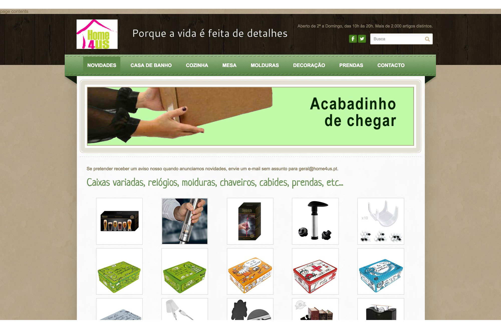
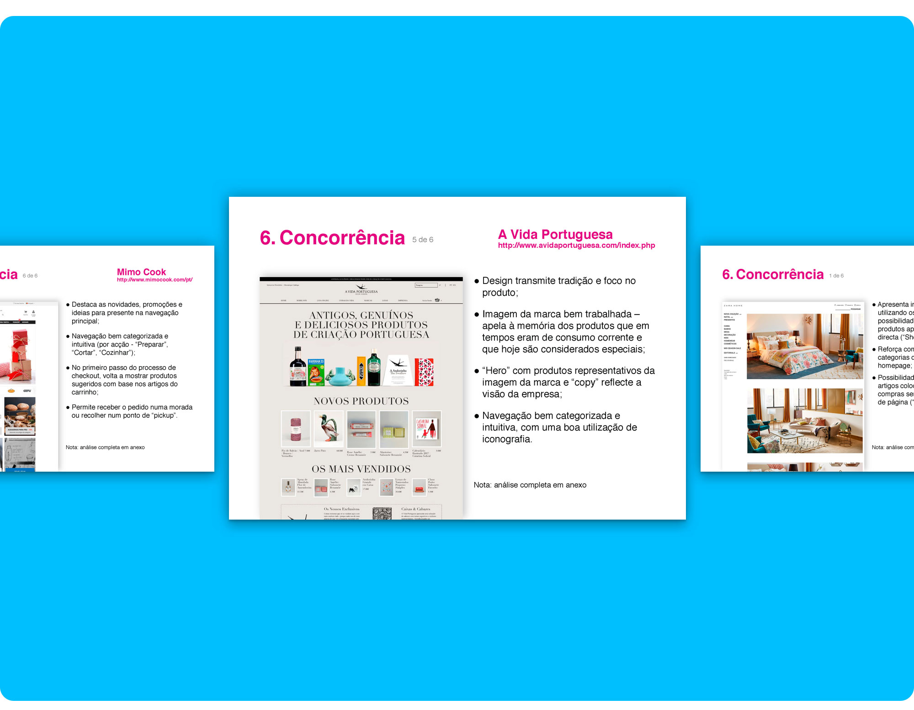
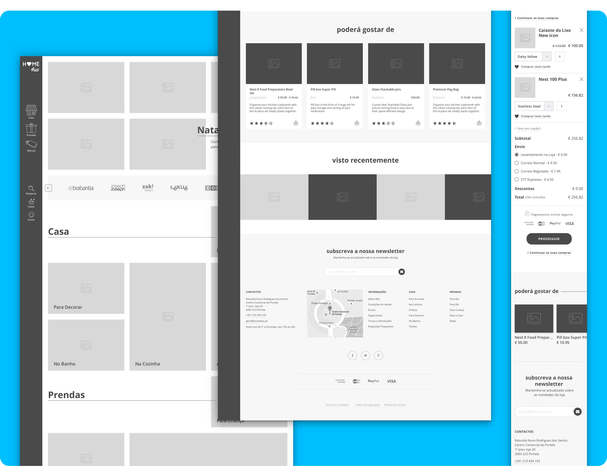

# Home4Us Online Store Redesign

Website redesign and development (proof of concept) for Home4Us, a Portuguese company that sells household and decoration articles with a gift shop section.

[homepage](https://filipago.github.io/home-4-us/)  //  [product page](https://filipago.github.io/home-4-us/produto.html)  //  [contact form](https://filipago.github.io/home-4-us/contactos.html)

Home4Us is a multi-brand store, founded 10 years ago and a family company whose members and unique collaborators are mother and daughter.

Even though the shop is located in a local shopping center, their business philosophy focus on proximity trading and offering a personalized service to their customers. The company's main message is
“Home 4 Us: Because Life is made of
Details”.

## Redesign Goals

Improve the website's navigation and build a responsive online shop that can help extend their customer base to other geographical areas, without investing in the rental of new spaces for physical shops. Above all, a design that keeps focus on the products and reflects the brand's values:

* Modernity;
* Simplicity;
* Attention to detail;

Bring Home4us' outdated website to the 21st century with a bold and edgy redesign that conveys a friendly, neighbourly and positive vibe!

  

*Home4Us' old and outdated Weebly website, unsuitable for
the requirements of today's users (screenshot). The website was not responsive and wasn't an online shop; it had a
mobile version but with a lot of navigation problems and low quality photography that didn't properly showcase the products' quality and brand values.*

 

*The website had a huge bounce rate.*

### Project Phases

* Briefing definition, scope and objectives;
* Target Users definition;
* Proto-personas;
* Benchmarking analysis;
* Documentation on the current site's information architecture and contents (as-is analysis);
* New information architecture;
* User flows;
* Wireframes;
* Visual identity;
* Mockups:
  * [Desktop mockups](https://invis.io/67A1EI19M)
  * [Mobile mockups](http://invis.io/B7A1X102H)
* Prototype;

 

*Example page from the Benchmarking Analysis presentation to the client. You can check out the complete analysis [here](_docs_readme/benchmarking_structure.xlsx "Websites' Structure Benchmarking Analysis") and [there](_docs_readme/benchmarking_strong-and-weak.pdf "Websites' Strengths and Weaknesses Benchmarking Analysis") (you can't preview the files here; you have to download the documents... sorry).*

 

*The old information architecture was quite messy and had too many categories for such a small shop*

 

*The new information architecture is a lot cleaner and reduces the top level categories in the main navigation to three: home, gifts and brands. The information architecture's document can be found [here](_docs_readme/sitemap_home4us.xlsx "Website's Information Architecture")*

 

*Some early stage wireframes (always with real content!).*
